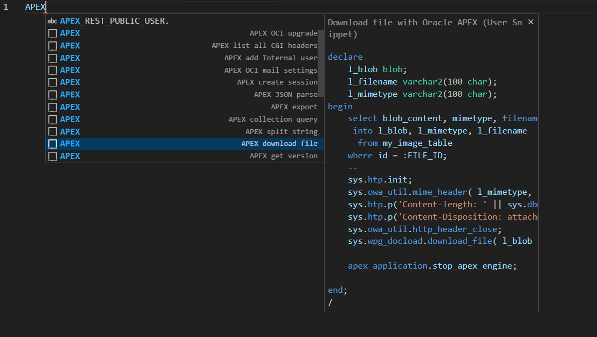
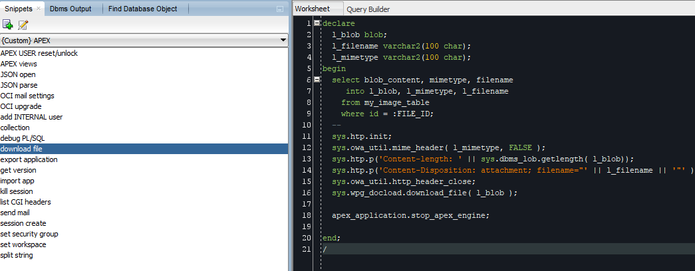

# Oracle APEX Snippets

In this GitHub repository you can find some useful snippets which can improve you APEX development speed. These snippets I use often and find them useful. Suggestions are most welcome !

## Oracle APEX Visual Code Snippets

File : [oracle_sql.json](./VS/oracle_sql.json)

Readme : [VS snippets Readme](./VS/readme.md)

Preview :

## Oracle APEX SQL Developer Snippets

File : [UserSnippets.xml](./SQL_Developer/UserSnippets.xml)

Readme : [SQL Developer snippets Readme](./SQL_Developer/readme.md)

Preview :

## Other Useful Links

[Hayden Hudson VS logger Snippets](https://gist.github.com/hhudson/a99db2d2715ee805e9c4bf10d63b305d) 
[Insum - APEX 127 – VS Code Snippets](https://www.insum.ca/apex-instant-tips-127-vscode-snippets/apex-127-vs-code-snippets/)

